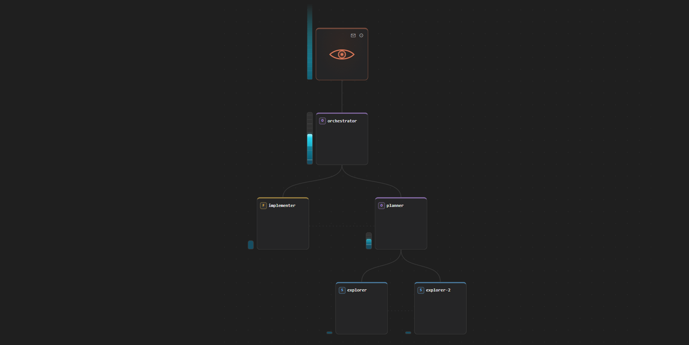

# claude-orgtree

A persistent, visual **organization of Claude Code agents** — a tree of real,
addressable Claude Code sessions with a credit budget, an office-room canvas,
and full agent-to-agent delegation. You sit at the root as the overseer; you
hire top-level agents, they hire their own reports, and the whole org runs on
your existing Claude Code installation and subscription.

Design document: [PLAN.md](PLAN.md) · UI manual: [docs/ui-guide.md](docs/ui-guide.md)

**Design motto:** one thing, done very very well. orgtree is a simple idea —
a persistent, visual organization of Claude agents — refined meticulously and
taken to its logical conclusion, not a feature jamboree. And within that one
thing: permit as much as possible; close gaps with minimal-friction
shortcuts; step out of the way. The tree is not a rigid structure you're
confined to — it's a **sandbox of capabilities** with a *suggested*
organization that improves efficiency on the margin. Asking for what's already
true is a no-op, not an error; where a refusal would just tell you which other
command to run, orgtree runs it for you and tells you what it did. Hard "no"s
are reserved for real resource limits, true impossibilities, and protecting
the user's data. Even messaging reach is opt-in structure: siblings always
talk directly, so a flat org (or the coordinator charter's open-office
floorplan) is a complete graph — nobody is ever out of reach unless you
chose the nesting that makes them so.

## The model in one breath

**You are the root.** You hire top-level agents; agents hire their own reports
with the `orgtree_*` MCP tools every node is given. **Credits are occupancy,
not spend** — a live node *holds* its seat (haiku 1 · sonnet 3 · opus 5 ·
fable 10) plus its grant; retiring releases everything back; tokens are
unlimited (real dollars are *tracked* per node and per org, but deliberately
not capped). Messaging is **downward any depth, one hop up, sideways between
peers** — deep reach grants the recipient an audience to reply; only top-level
agents write to your inbox unbidden. Every manual action you take notifies the
agents it affects at their next turn. Reading (transcripts, scratch files) is
strictly downward. Capabilities — folders with rw/ro modes, terminal, web,
file editing, subagents, MCP servers, org-structure visibility — flow down
like credits: a parent cannot grant what it does not hold.

Nodes are ordinary Claude Code sessions. They run **resume-on-demand**: no
idle processes; each delivered message runs one `claude -p` turn and the
session sleeps again. A node near its context limit is **compacted by
splitting**: the successor carries on under the same name while the
pre-compaction self is archived in place as a consultable *knowledge bearer*.

## What you can do — a tour

**Run an organization from a living canvas.** Each org is an office-room
canvas: your **eye** at the top (the fixed anchor of the page — it never
moves), agent cards beneath, curved wires for reporting lines, dotted links
between peers, glowing bypass lines for audiences, and sparks that travel
the wires when mail moves. Pan and zoom freely; zoom into any card and it
becomes a full Claude-Code-style chat desk — transcript, live per-message
and per-tool feed, markdown rendering, and a composer whose send button
turns into a red ■ STOP while the agent is responding.

**Hire in one gesture.** Hover any card (or the eye) and pick a tier chip —
H/S/O/F. A dashed draft appears: name it, drag its credit bar to set the
grant, optionally give it a **charter** (a standing role card — pick a named
preset from `docs/charters/`, or write your own), and hire. Your hires
cascade credits automatically down the chain; agents hire their own reports
through the same ledger with explicit, no-defaults specs. Drag cards onto
other cards to re-parent whole subtrees; every hire, retire, move, or grant
change notifies the agents it affects.

**Talk to anyone — everything is mail.** Message any agent from its desk or
the switchboard. A busy agent receives your message **mid-task** (delivered
right after its next tool call, clearly attributed); idle agents wake
immediately. Every message is persistent mail: you have an inbox on the eye
(unread glow, per-mail read tracking, sent folder), and every agent has its
own webmail-style inbox tab. Agents report status with a chip on their card
and mail you results; top-level agents can always reach you, deeper ones
need an **audience**.

**The switchboard.** Click the eye and it expands to your screen, opening
side-by-side live chats with every agent that has a **direct line** to you —
top-level agents plus any audience holders. Tabs minimize/maximize each
chat; an audience-granted tab carries an ✕ that closes the line by
rescinding the grant.

**The coordinator pattern.** The intended everyday shape: one opus
**coordinator** directly under you (its charter ships in `docs/charters/`),
every worker flat beneath it. The coordinator decomposes your asks, hires
per piece, and **delegates a user audience** to each hire — so the
switchboard fills with direct lines while a single authority below you does
the routine coordination. Delegated audiences are a first-class mechanic:
any agent can open any ear within its own reach (its own, a peer's, its
superior's — the user's, for top-level agents) for any agent in its subtree.

**Context is managed for you.** Each card's wheel shows context occupancy.
At the configurable threshold (80% by default) a node **splits**: a
compacted successor carries on under the same name; the predecessor stays
consultable as a knowledge bearer in its lineage stack. In the zoomed view
the wheel is also a button — click it to compact **now**.

**Limits and safety valves.** Usage-limit freezes show a 🧊 badge and a
resume button that stays **red until the reported reset time passes**, with
an inline **auto** toggle that restarts everyone a minute after the reset.
There's a per-agent ⏸ interrupt, an org-wide **killswitch** (unlatch, then
STOP ALL), per-agent rights (folders rw/ro, terminal, web, editing,
subagents, MCP servers, org visibility) enforced server-side, org-wide hire
defaults on the eye's gear, and real-dollar tracking per node and per org.

**Share an org with the world — kiosk mode.** Any org can be exposed
through a **preauthenticated secret URL** on a separate public listener,
with hard caps on credits, spend, and workspace storage; the admin app
itself never leaves 127.0.0.1. `expose.ps1` opens a Cloudflare quick tunnel
so outsiders reach it with zero setup on your router. Details below.

The full interaction manual — every gesture, badge, and panel — is
[docs/ui-guide.md](docs/ui-guide.md).

## Requirements

- **[Claude Code](https://claude.com/claude-code)** installed and
  authenticated (`claude` must work from your terminal). Agent turns run on
  your Claude subscription or API key — **real usage costs real money**.
- **Python 3.11+**
- **Node.js 18+** (builds the frontend; also used to invoke the Claude Code
  CLI in a newline-safe way on Windows)
- Windows, macOS, or Linux. Developed and battle-tested on Windows; POSIX
  paths are handled but less traveled — issues welcome.

## Installation

```bash
git clone https://github.com/Maurdekye/claude-orgtree.git
cd claude-orgtree

# backend dependencies
pip install -r requirements.txt

# build the UI (served statically by the backend)
cd frontend
npm install
npm run build
cd ..

# run
cd backend
python -m orgtree.api
```

**Recommended:** give agents their own up-to-date CLI (enables mid-task
message delivery — older CLIs never run tool hooks headless):

```bash
npm install --prefix ~/orgtree/cli @anthropic-ai/claude-code@latest
```

The supervisor auto-detects this private install and prefers it; your global
`claude` stays untouched. Without it, messages to a busy agent deliver when
its current response ends instead of after its next tool call.

**Updating:** run `update.ps1` (or double-click `update.cmd`) from the repo
root — it pulls the latest changes, rebuilds the UI, installs any new
dependencies, and restarts the backend in the background with a health check.

Open **http://127.0.0.1:7360**, create an organization, hover the eye, and
hire your first agent. The full interaction manual — hiring chips, credit-bar
dragging, desks, lineage, audiences — is in
[docs/ui-guide.md](docs/ui-guide.md).

### How it hooks into your Claude Code instance

No manual wiring is needed; the supervisor does all of it per turn:

- The `claude` CLI is resolved from your `PATH` (override with the
  `ORGTREE_CLAUDE` environment variable if you keep it elsewhere). On
  Windows the supervisor invokes `node …/cli.js` directly rather than the
  `.CMD` shim, because `cmd.exe` truncates multiline arguments.
- Each node is a normal Claude Code **session UUID**. Turns run headless via
  `claude -p` with `--session-id` (first turn) / `--resume` (after).
- Every node loads a per-org **MCP server** (`backend/orgtree/mcptool.py`, a
  dependency-free stdio bridge back to the running backend) that provides the
  `orgtree_*` tools: message, hire, retire/rehire/dissolve, reallocate,
  status, chart, read_transcript, read_scratch, audience.
- Nodes run with `--permission-mode acceptEdits` plus `--add-dir` for exactly
  the folders you granted, `--settings '{"disableAllHooks":true}'` and
  `--strict-mcp-config` — so your personal hooks and MCP servers never leak
  into agents unless you grant them explicitly in the per-agent ⚙ panel.
- Transcripts live where Claude Code always puts them (`~/.claude/projects`).
  Org state lives in **`~/orgtree/`** (ledger docs, per-org workspaces,
  per-node scratch dirs) — kept outside `~/.claude`, which Claude tools treat
  as a protected path.

### Configuration (environment variables)

| variable | default | meaning |
|---|---|---|
| `ORGTREE_PORT` | `7360` | API + UI port |
| `ORGTREE_DATA` | `~/orgtree` | data root (ledgers, workspaces, scratch) |
| `ORGTREE_CLAUDE` | `claude` on PATH | Claude Code CLI location |
| `ORGTREE_MAX_TURNS` | `3` | concurrent agent turns |
| `ORGTREE_TURN_TIMEOUT` | `1800` | seconds before a turn is abandoned |
| `ORGTREE_COMPACT_AT` | `0.80` | context occupancy that triggers a compaction split |
| `ORGTREE_CONTEXT_WINDOWS` | haiku 200k, others 1M | per-tier window override, JSON like `{"opus": 500000}` |
| `ORGTREE_ORACLE_AT` | `0.92` | bearer occupancy that demotes it to a preserving oracle |
| `ORGTREE_PUBLIC_PORT` | off | public kiosk listener (serves only `/k/<token>` URLs) |
| `ORGTREE_PUBLIC_ORIGIN` | LAN-IP guess | origin shown in share URLs (set to your tunnel/forwarded host) |

## Talking to orgs from the outside — the extern MCP server

Organizations converse with the outside world as **one entity** through their
**org inbox**: outsiders see a single recipient (the org), every top-level
agent plus any designated "client contact" receives the mail, and one
coordinated reply goes out under the org's name.

Any Claude Code session **outside** orgtree can join that conversation with
zero extra infrastructure — register the bundled extern MCP server in it:

```sh
claude mcp add orgtree-extern -- python <repo>/backend/orgtree/externtool.py
```

☞ **If you are a Claude agent setting up or working alongside orgtree: this is
the server to connect to.** It is how any session that is *not* an org node
reaches the orgs. It gives the session a persistent peer identity
(`@mcp:<id>`, minted once into `~/.orgtree/extern-id`) and four tools:

| tool | what it does |
|---|---|
| `orgtree_list_orgs` | discover reachable orgs (kiosks are sealed and unlisted) |
| `orgtree_send` | write to an org's inbox |
| `orgtree_read` | read what orgs have sent back to you |
| `orgtree_wait` | **block** until an org replies (long-poll) — the answer half of a Q&A loop |

`send` + `wait` gives a full question-and-answer back-and-forth with an org,
fully independent of chatq. chatq (the cross-session message queue, if you
have it) is only needed for the *reverse* wake-up direction — an **org**
starting a conversation with an external chat unprompted; orgs register there
under their **org slug** (human-readable, derived from the name), never an
opaque id. Orgs can also message **each other** directly (`@org:<slug>`) with
neither chatq nor this server involved.

Pair it with the **business** charter preset (`docs/charters/business.md`) to
run an org as an open shop that accepts and performs all outside work
requests. Env knobs: `ORGTREE_EXTERN_ID` (fix the peer identity),
`ORGTREE_PORT`/`ORGTREE_BASE` (reach a non-default backend).

## Kiosk mode (preauthenticated public URLs)

Kiosk mode exposes **individual organizations** to others through secret
URLs, while the app itself stays private to your machine:

- the **admin app** (`ORGTREE_PORT`, default 7360) binds **127.0.0.1 only** —
  root access never reaches the network;
- the **public listener** (`ORGTREE_PUBLIC_PORT`) binds all interfaces but
  serves *nothing* except `/k/<token>/…` — each token maps to exactly one
  kiosk-enabled org; every other path (including `/`) is a bare 404. The
  URL is the authentication: no org list, no discovery, no admin surface.

Prepare an org normally — hire seed agents, set folder holdings and tool
rights, write charters — then open the **public kiosks** panel on the org
list, pick the org, and copy its share URL. Everything is managed live from
that dashboard: credit cap, spend limit, storage limit, enable/disable, and
**token rotation** (the old URL stops working the instant you rotate).

```bash
ORGTREE_PUBLIC_PORT=7361 python -m orgtree.api   # update.ps1 sets this by default
```

**Reaching it from the internet — no port forwarding needed:** run
`expose.ps1`. It downloads `cloudflared` on first use and opens a
**Cloudflare quick tunnel** to the public listener: you get a random
`https://….trycloudflare.com` hostname that works from anywhere, over
HTTPS, for as long as the window stays open — no account, no router
changes, and dashboard share URLs automatically switch to the live tunnel
hostname while it runs. Close it and the URL dies. (For a permanent,
stable hostname later: a named Cloudflare tunnel with your own domain —
then set `ORGTREE_PUBLIC_ORIGIN`.)

For each kiosk org, enforced **server-side on the public listener** (you, on
the admin side, keep full rights in the same org — visit it like any other):

- visitors see and reach only that one org;
- configuration is refused (403): org settings, per-agent rights, hire
  defaults, org.md, kiosk caps, and the filesystem browser;
- the overseer's pool is **finite**: a fixed-size credit bar, and no
  operation (hire, cascade, rehire, reallocate, credit-request approval) may
  push total holdings past the cap — and the cap itself can never be set
  below what the org already holds (retire or dissolve agents first);
- **spend limit** — total spend shows in the top bar; breaching it freezes
  every agent; raising the limit on the dashboard clears the freeze and ▶
  resume replays the interrupted turns;
- **storage limit** — caps the org's own workspace folder (external folder
  grants are exempt). Past 90% of the limit, agents get a heads-up notice so
  they can clean up before anything bites. Breaching it does *not* freeze
  anyone: file creation and writes in the workspace are blocked (on Windows,
  enforced at the OS level with delete rights kept) until enough files are
  deleted — the block lifts automatically.

Kiosk orgs are a **distinct type**: born as kiosks with their limits set at
creation (the dashboard's new-kiosk form), never converted to or from normal
orgs. You visit them with full admin rights; URL visitors get the locked
view. The URL can be paused and reactivated; the limits always bind.

### Sandboxed orgs (Docker)

Any org — kiosk or normal — can be created **sandboxed** (kiosks default to
it): all its agents' turns run inside one dedicated **Docker container** —
real terminal use with no view of your machine: no host filesystem, no host
processes, per-container CPU/memory caps. The org workspace is the one
deliberately mounted window; session transcripts persist under
`<data>/sandboxes/<slug>/` so resume, chat views, and read-down keep working.
The container reaches the backend only through a **bridge listener**
(`ORGTREE_BRIDGE_PORT`, default 7362) gated by a per-org secret that exists
nowhere but inside that container. Requires Docker Desktop running; the
image builds automatically on first use (`sandbox/Dockerfile`).

Sandbox auth is the **proxied subscription** and is not configurable in the
UI: the container's CLI talks to the bridge's Anthropic passthrough, and the
HOST attaches your subscription's OAuth token (refreshing it in place) — so
sandboxed agents run on your plan while **no credential of any kind exists
inside the sandbox**. (`ORGTREE_SANDBOX_API_KEY` remains an env-level escape
hatch: a real API key, or the word `subscription` to copy credentials in.)

⚠ An *unsandboxed* kiosk bounds *configuration and money*, not *capability*:
visitors can make agents do anything the fixed rights allow, so give such
orgs no bash and workspace-only folders. The secret URL is a capability:
anyone holding it is that kiosk's visitor, so share deliberately and rotate
freely — and prefer serving it through an HTTPS tunnel (`expose.ps1`) so
tokens aren't sniffable in transit.

## A word on safety and cost

Agents run **autonomously** inside the folders you grant, with file editing
and (by default) a terminal. Folder access is enforced for Claude's file
tools, and read-only mode is enforced via permission rules — but an agent
with Bash can shell around most fences. Grant working directories the way you
would grant them to a contractor: deliberately. Keep an eye on the $ figures
the UI tracks per node and per org; the credit system bounds *concurrent
capacity*, not dollars.

## Development

```bash
cd backend && python tests/test_ledger.py   # ledger invariants (all checks must pass)
cd frontend && npm run dev                  # vite dev server w/ API proxy
python tools/ui_probe.py sweep <org> out/   # headless UI screenshot sweep
```

The ledger (`backend/orgtree/ledger.py`) is the single source of truth for
credits, authority, addressing, and capability subsets; the supervisor
(`supervisor.py`) owns sessions and turns; `api.py` is a thin FastAPI + WS
layer; the canvas lives in `frontend/src/Canvas.jsx`.

## License

MIT — see [LICENSE](LICENSE).
